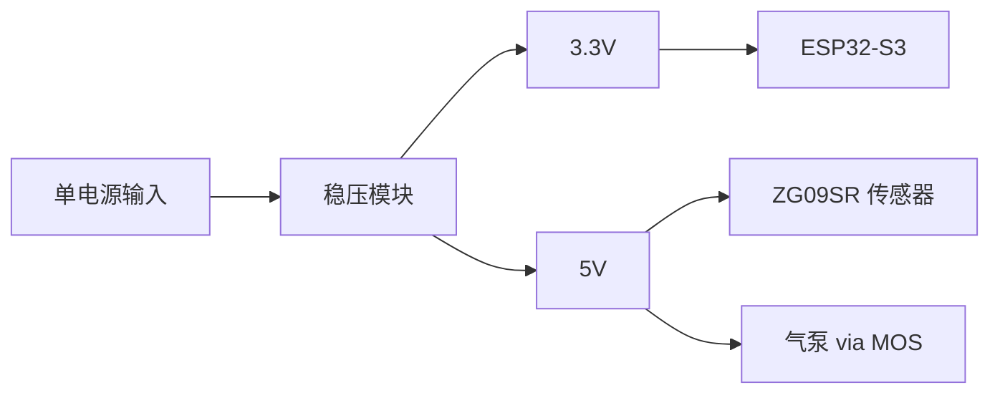
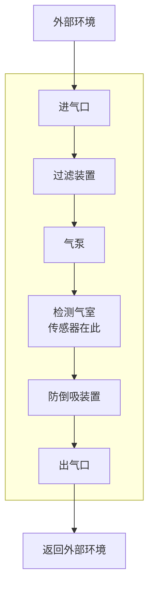

# 硬件接线指南

## 硬件清单

| 组件 | 型号/规格 | 数量 | 说明 |
| ---- | --------- | ---- | ---- |
| 主控板 | ESP32-S3-DevKitC-1 | 1 | 主控制器 |
| CO2 传感器 | ZG09SR | 1 | NDIR 红外，Modbus RTU |
| 微型气泵 | 5V 微型气泵 | 1 | 闭环采样用 |
| MOS 驱动模块 | 四脚 MOS 驱动板 | 1 | 控制 5V 气泵 |
| 电压转换/稳压 | 降压/分压模块 | 1 | 单电源分为 3.3V 和 5V |
| 过滤装置 | 过滤棉/滤网 | 1 | 进气过滤 |
| 防倒吸装置 | 单向阀等 | 1 | 防止水倒吸 |
| 密封盒 | 塑料密封盒 | 1 | 容纳气泵和传感器 |

## 电源配置

本系统使用**单电源输入**，通过稳压/分压模块分为两路：

## 气体流程

**说明**：
- 气泵和传感器都在密封盒（黄色）内部
- 传感器的检测气室是密封的独立区域，减小气体扩散空间，增加传感器灵敏度
- 防倒吸装置防止液体（如藻类培养液）倒流进入系统
- 气路形成闭环，确保气体充分循环

## 引脚连接总表

### ESP32 引脚分配

| ESP32 引脚 | 连接目标 | 说明 |
| ---------- | -------- | ---- |
| 3V3 | 电源 | 由外部 3.3V 电源供电 |
| GND | 公共地 | 与所有模块共地 |
| GPIO 16 | ZG09SR RX | 传感器接收 |
| GPIO 17 | ZG09SR TX | 传感器发送 |
| GPIO 18 | MOS 模块 PWM | 气泵 PWM 控制 |

### ZG09SR CO2 传感器

| ZG09SR 引脚 | 连接目标 |
| ----------- | -------- |
| VCC | 5V 电源 |
| GND | 公共地 |
| RX | ESP32 GPIO 16 |
| TX | ESP32 GPIO 17 |

### MOS 驱动模块

MOS 驱动模块用于将 ESP32 的 3.3V PWM 信号放大，以控制 5V 气泵。

| MOS 模块引脚 | 连接目标 |
| ------------ | -------- |
| PWM（或 SIG） | ESP32 GPIO 18 |
| GND | 公共地 |
| + (VCC) | 5V 电源 |
| - (OUT-) | 气泵负极 |
| OUT+ | 气泵正极（接 5V） |

> 不同厂家的 MOS 模块引脚标注可能略有不同，请参考实际模块说明。

## 注意事项

1. **共地**：所有模块必须共地
2. **防水**：防倒吸装置务必安装，尤其在涉及液体的环境中
3. **密封性**：虽然本项目有漂移补偿算法，但尽量保证气路密封性以获得更好的原始数据
4. **散热**：长时间运行注意 MOS 模块散热

## 可选：温湿度传感器（预留）

固件预留了温湿度接口，暂未实际使用。如需添加：

| 传感器 | 建议引脚 |
| ------ | -------- |
| DHT22 DATA | GPIO 4（示例） |
| SHT30 SDA | GPIO 21 |
| SHT30 SCL | GPIO 22 |
